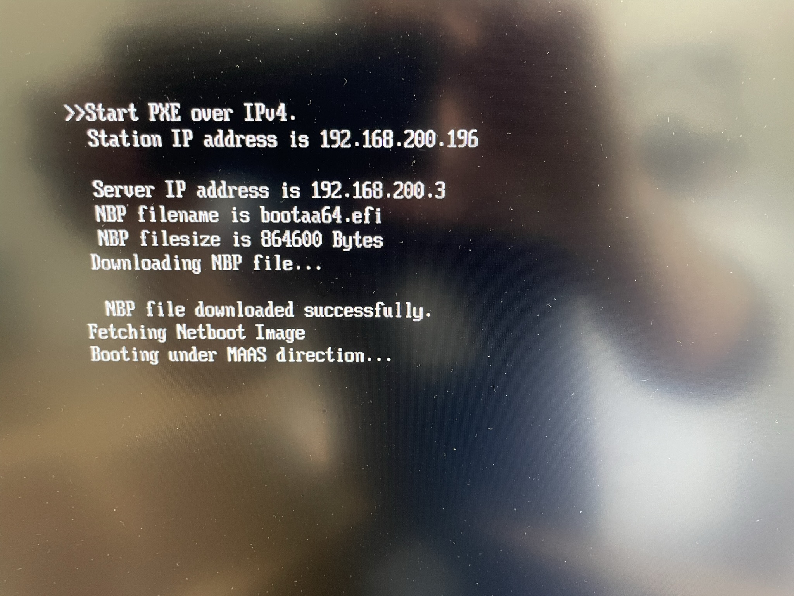

# Build your own bare metal cloud using a Raspberry Pi cluster with MAAS

Taken from the below blogs:

> :warning: The purpose of this repository is to go through the tutorial (refreshing the missing images) below while waiting for Canonical to fix the Anton Smith's personal page who left for [SpectroCloud](https://www.spectrocloud.com/)

When clicking on the missing images, the links say : 

[:x: Google 403. That’s an error.](https://lh6.googleusercontent.com/oTmC7A5FY8IeQtYdUKj8gcKH4fZ9X-7hg0X9eISV3E3NP0iZgljwCblFHnV8SUP0U01sCJx-_eRP00DD-8w9Ab3BH1JmJpD5qHGK2_Hl16LEp3ViSYiGuNmi1ddvcuWUCTXtzBgv) ACL Denied `That’s all we know.`

They are linked to Anton Smith's Google Account

- [ ] [billwear 6 Jun yep, looks like it was in his user content, which is now blocked. i’ll have to get with IS, sorry about that.](https://discourse.maas.io/t/build-your-own-bare-metal-cloud-using-a-raspberry-pi-cluster-with-maas/5845/8)

- [ ] [Build your own bare metal cloud using a Raspberry Pi cluster with MAAS](https://discourse.maas.io/t/build-your-own-bare-metal-cloud-using-a-raspberry-pi-cluster-with-maas/5845)

- [ ] [Provisioning of Raspberry Pi 4 with MAAS](https://discourse.maas.io/t/provisioning-of-raspberry-pi-4-with-maas/2243)

---

- [ ] [Bare metal Kubernetes hands on tutorial with MAAS and Juju](https://www.youtube.com/watch?v=sLADei_c9Qg) using just a single computer :computer: with Anton Smith
- [ ] [:roll_of_paper: (reposiitory of ) Bare metal Kubernetes with MAAS, LXD, and Juju](https://github.com/antongisli/maas-baremetal-k8s-tutorial)

---

| Table of Contents              |
|--------------------------------|
| [Overview](README.md#Overview) |
| [What you'll learn](README.md#what-youll-learn)  |
| [Prepare RPis to be managed by MAAS](README.md#prepare-rpis-to-be-managed-by-maas) |
| [Install and configure maaspower](README.md#install-and-configure-maaspower) |
| [Install and configure MAAS](README.md#install-and-configure-maas) |

## Overview

Duration: 1:00

These days it’s everybody’s dream to build their own bare metal K8s cluster. Whether it’s for learning purposes, running Blender, or even building out production infrastructure, people love running their own clusters.

The Raspberry Pi 4 (RPi) with it’s relatively fast CPU cores, up to 8 GB of RAM, and tiny physical footprint presents a great option to run a cluster on. Provisioning all those RPis can be a pain however, and people have wanted to use tools like [MAAS](https://maas.io/) [`5`](https://maas.io).

For years the community has wondered how to use MAAS with RPis, but hasn’t quite cracked it - until now, that is. Two problems needed to be overcome to use MAAS with RPis:

- [ ] Booting and installing an operating system with MAAS
- [ ] Power control

Thanks to community members [Giles](https://discourse.maas.io/u/gilesknap/summary), [lory696](https://discourse.maas.io/u/lory696/summary), [someo_new](https://discourse.maas.io/u/someo_new) and others, these problems have been overcome.

In this tutorial, we will put all their efforts together and show you how to build your own small, fully managed bare metal Raspberry Pi cluster. When you’re finished with this tutorial, you’ll be at a point where you can install [microK8s](https://microk8s.io) so that you end up with a fully functioning Kubernetes cluster that is ready to be managed by any tool you like, such as Juju.

This tutorial is not meant to be exhaustive for all the possible ways to build a cluster, but should teach you all the basics needed in order for you to try other techniques. For example, perhaps you’d like to use a PoE switch instead of the UUGear Mega4 USB hub used in this tutorial. At the end, you might end up with something that looks a bit like this:

> :warning: DISCLAIMER
> 
> This tutorial is provided “as is” and with no warranty. It makes use of the RPi UEFI project and uses the generic ARM64 kernel and image from Canonical. > Canonical does not officially support the RPi UEFI project nor does it support using the generic ARM64 kernel and image on Raspberry Pis.

With the above disclaimer out of the way, let’s get started!

## What you’ll learn

Duration: 0:30

In this tutorial you will learn:

- [ ] how to choose the right equipment to build a RPi cluster
- [ ] how to set up a simple network for your cluster
- [ ] how to prepare RPis to be managed by MAAS
- [ ] how to install and configure maaspower
- [ ] how to install and configure MAAS
- [ ] how to use MAAS to manage Raspberry Pis
- [ ] how to install microk8s and how to use Juju to control your cluster

## What you’ll need

Duration: 2:00

In order to build your cluster you will need some equipment. You also need to separate the cluster network from your home network by adding a router running NAT. We will be building something similar to the below:


You will need:

- [ ] A spare PC, VM, or RPi to run as a control server. It should have at least 4 GB of RAM and approximately 16 GB of spare disk space. It needs to have at least one spare network interface (ethernet). This server will run MAAS, and host the maaspower service. It will also need python 3.8 or later.

- [ ] a UUGear Mega4 10, which we will use for controlling power to the RPis. The UUGear hub should be connected to your control server via its USB uplink port. 

 </img>

- [ ] an optional male-female USB-A cable to connect the control server to the UUGear hub

- [ ] The Mega4 needs to be powered by one of the following power supplies:
    - [ ] an external ‘dumb’ power supply - not Power Delivery. Your option will depend on how many RPIs you want to support on each MEGA4 Hub. See here 2 for details
    - [ ] Official Raspberry Pi USB C 15W supply - for 2 RPIs
    - [ ] A good quality ‘dumb’ 5V 5A (25W) supply with a USB C converter - for 3 RPIs
A good quality 5V 10A (50W) supply soldered directly to the power rails - for 4 RPIs. e.g. https://uk.rs-online.com/web/p/embedded-switch-mode-power-supplies-smps/1618278 [`9`](https://uk.rs-online.com/web/p/embedded-switch-mode-power-supplies-smps/1618278)
    - [ ] This RS power supply Part No. 161-8278 has been tested with MEGA4 and 4 RPIs
 </img>
    - [ ] A switch with enough ports to connect the control server, the RPis, and a router
    - [ ] A router running NAT and with access to the internet, to keep MAAS and the RPIs separated from your home network. Instead of a separate switch and router, you can use a typical wifi router so long as it has enough ethernet ports on it.
    - [ ] At least one RPI4 for your cluster. Each RPi needs an SD card (the smallest size you can find).
    - [ ] A USB stick for each RPI4, which will be used for storage by your RPis. Try to use a decent USB stick if storage performance is important to you.

## Prepare RPis to be managed by MAAS

Duration: 10:00

We need to set up our RPis so that they’ll netboot. To get this working with MAAS, we need to use UEFI. The RPi will boot first from the SD card, load UEFI, and then netboot:


To get this working, we need to do the following:

Prepare SD cards with RPi UEFI
Configure each RPI’s UEFI settings
You’ll need a keyboard and a screen during this step.

Use the [guide here from community member Giles Knap](https://github.com/gilesknap/IaC-at-home/blob/main/nas/03-maas/MakeUefiSd.md) [`14`](https://github.com/gilesknap/IaC-at-home/blob/main/nas/03-maas/MakeUefiSd.md) to prepare your RPIs. When you are done, you can move on to the next step. Below you can see an example

<i>Example following Gile’s guide:</i>

### Identifying the correct drive (based off SD card size of 32 GB)

```
ubuntu@proud-possum:~$ lsblk
NAME        MAJ:MIN RM   SIZE RO TYPE MOUNTPOINT
loop0         7:0    0 110.8M  1 loop /snap/core/12725
loop1         7:1    0  61.9M  1 loop /snap/core20/1361
loop2         7:2    0  13.7M  1 loop /snap/maas-cli/13
loop3         7:3    0  67.9M  1 loop /snap/lxd/22526
loop4         7:4    0  61.9M  1 loop /snap/core20/1328
loop5         7:5    0  67.2M  1 loop /snap/lxd/21835
loop6         7:6    0  32.2M  1 loop /snap/maas-test-db/91
loop7         7:7    0 136.9M  1 loop /snap/maas/18199
loop8         7:8    0  55.5M  1 loop /snap/core18/2284
loop9         7:9    0 127.4M  1 loop /snap/multipass/6130
loop10        7:10   0  43.6M  1 loop /snap/snapd/14978
loop11        7:11   0   240K  1 loop /snap/jq/6
sda           8:0    1   1.9G  0 disk 
└─sda1        8:1    1   1.9G  0 part 
nvme0n1     259:0    0 931.5G  0 disk 
├─nvme0n1p1 259:1    0     1M  0 part 
└─nvme0n1p2 259:2    0 931.5G  0 part /
```

Here we can see it is sda based off the disk size because we know the USB stick is 2GB in size.

### Option 1 - Ubuntu 20.04 - Download the card maker script and run it

This option will give you a UEFI card that will work with Ubuntu 20.04 only.

> :warning: If you want to use 21.10 then choose Option 2 below. Don’t do both Option 1 and Option 2 .

```bash
ubuntu@proud-possum:~$ curl -LO https://raw.githubusercontent.com/gilesknap/IaC-at-home/main/nas/03-maas/uefi.make.sh
  % Total    % Received % Xferd  Average Speed   Time    Time     Time  Current
                                 Dload  Upload   Total   Spent    Left  Speed
100  1264  100  1264    0     0   5180      0 --:--:-- --:--:-- --:--:--  5159
```

```bash
ubuntu@proud-possum:~$ export DISK=/dev/sda
ubuntu@proud-possum:~$ bash ./uefi.make.sh
Make a UEFI boot disk for raspberry Pi
using the file

*** WARNING**** this will delete everything on the target disk
use the command lsblk to verify you have the right device name

Enter device name of the disk e.g. /dev/sde (/dev/sda) :
umount: /dev/sda1: not mounted.
Checking that no-one is using this disk right now ... OK

Disk /dev/sda: 1.91 GiB, 2032664576 bytes, 3970048 sectors
Disk model: USB3.0 CRW   -SD
Units: sectors of 1 * 512 = 512 bytes
Sector size (logical/physical): 512 bytes / 512 bytes
I/O size (minimum/optimal): 512 bytes / 512 bytes
Disklabel type: dos
Disk identifier: 0x00000000

Old situation:

Device     Boot Start     End Sectors  Size Id Type
/dev/sda1         249 3967487 3967239  1.9G  6 FAT16

>>> Script header accepted.
>>> Script header accepted.
>>> Script header accepted.
>>> Script header accepted.
>>> Created a new DOS disklabel with disk identifier 0x71d59d14.
/dev/sda1: Created a new partition 1 of type 'W95 FAT32 (LBA)' and of size 1.9 GiB.
/dev/sda2: Done.

New situation:
Disklabel type: dos
Disk identifier: 0x71d59d14

Device     Boot Start     End Sectors  Size Id Type
/dev/sda1  *     2048 3970047 3968000  1.9G  c W95 FAT32 (LBA)

The partition table has been altered.
Calling ioctl() to re-read partition table.
Syncing disks.
mkfs.fat 4.1 (2017-01-24)

  % Total    % Received % Xferd  Average Speed   Time    Time     Time  Current
                                 Dload  Upload   Total   Spent    Left  Speed
100   667  100   667    0     0   1911      0 --:--:-- --:--:-- --:--:--  1911
100 3046k  100 3046k    0     0  3751k      0 --:--:-- --:--:-- --:--:-- 3751k
Archive:  ../uefi.firmware.zip
  inflating: RPI_EFI.fd
  inflating: bcm2711-rpi-4-b.dtb
  inflating: bcm2711-rpi-400.dtb
  inflating: bcm2711-rpi-cm4.dtb
  inflating: config.txt
  inflating: fixup4.dat
  inflating: start4.elf
   creating: overlays/
  inflating: overlays/miniuart-bt.dtbo
  inflating: Readme.md
   creating: firmware/
   creating: firmware/brcm/
  inflating: firmware/brcm/brcmfmac43455-sdio.txt
  inflating: firmware/brcm/brcmfmac43455-sdio.bin
  inflating: firmware/brcm/brcmfmac43455-sdio.clm_blob
  inflating: firmware/brcm/brcmfmac43455-sdio.Raspberry
  inflating: firmware/Readme.txt
  inflating: firmware/LICENCE.txt
ubuntu@proud-possum:~$
```

### Option 2 - Ubuntu 21.10 - Download the card maker script and run it
It is possible to use Ubuntu 21.10, but it requires a little bit more work. To get it to work, we have to alter the UEFI image with an updated DTB that matches the 21.10 kernel. It means we will:

 - [ ] Download the UEFI RPi image
 - [ ] Download the a deb package from Ubuntu and extract the DTB needed
 - [ ] Replace the DTB file and then create the SD card

> :warning: This tutorial was written for 20.04 Focal. If you choose to use 21.10, then in all the sections below where 20.04 is referenced, you should change it to use 21.10. For example, syncing 21.10 images, deploying 21.10, etc.

```bash
ubuntu@proud-possum:~$ curl -LO https://raw.githubusercontent.com/gilesknap/IaC-at-home/main/nas/03-maas/uefi.make.sh
  % Total    % Received % Xferd  Average Speed   Time    Time     Time  Current
                                 Dload  Upload   Total   Spent    Left  Speed
100  1264  100  1264    0     0   5180      0 --:--:-- --:--:-- --:--:--  5159
#create a working directory, get the UEFI firmware and unzip it
mkdir foo
cd foo
wget https://github.com/pftf/RPi4/releases/download/v1.32/RPi4_UEFI_Firmware_v1.32.zip
unzip RPi4_UEFI_Firmware_v1.32.zip
rm RPi4_UEFI_Firmware_v1.32.zip
#remove this as we will be replacing it
rm bcm2711-rpi-4-b.dtb

#get the deb package with the dtbs that we need for Impish
wget http://ports.ubuntu.com/pool/main/l/linux/linux-modules-5.13.0-20-generic_5.13.0-20.20_arm64.deb
mkdir foo2
dpkg -x linux-modules-5.13.0-20-generic_5.13.0-20.20_arm64.deb foo2/
cp ./foo2/lib/firmware/5.13.0-20-generic/device-tree/broadcom/bcm2711-rpi-4-b.dtb .
rm -r foo2/ linux-modules-5.13.0-20-generic_5.13.0-20.20_arm64.deb

# now zip it all up
zip -r rpi4-impish.zip *
mv rpi4-impish.zip ..
cd ..
rm -r foo

# run uefi maker
export DISK=/dev/sda
bash uefi-make.sh rpi4-impish.zip
```

### Boot the RPi from the new card and configure it

Insert your newly created SD card into your RPi.

Power your RPi off, and on again. Immediately push the escape key when it boots and you should enter the UEFI menu:

 </img>

Ensure the 3GB RAM limit is disabled:

 </img>

Under Boot Maintenance Manager -> Boot Options -> Change Boot Order specify PXEv4 as the first boot option:

 </img>

Commit all changes, and exit. Make sure you save any configuration if asked.

Power off the RPi, we’ll turn it on later once MAAS is ready.

## Install and configure maaspower

Duration: 10:00

[maaspower](https://gilesknap.github.io/maaspower/main/index.html) [`3`](https://gilesknap.github.io/maaspower/main/index.html) was created by [Giles](https://discourse.maas.io/u/gilesknap/summary). maaspower does the following things:

- [ ] Provides a RESTful API interface compatible with the [MAAS webhook driver](https://maas.io/docs/snap/3.1/ui/power-management#heading--webhook) [`1`](https://maas.io/docs/snap/3.1/ui/power-management#heading--webhook)
- [ ] Supports plugins to perform actions, for example running command line operations, or calling other APIs. These actions can correspond to `power on`, `power off`, and query operations

As an example, a flow for turning one of the RPis on would look like this:

 </img>

### Connect your UUGear hub

Connect your UUGear hub to your control server. Make sure you have a power supply connected to it as well, this tutorial uses a single official RPi power supply:

[:x: Google 403. That’s an error.](https://lh5.googleusercontent.com/-ZD30RC-EZIFU0Bfoye9JgJurgUUd7ZAJdeRQEBa1h9s46KExfsl3n35BDe0kMGDM7HYFmO0oilCPG_n9nl4OreXmQJBPJ5J8uWZCt91wDZMB2k7QRPzArveMg87u2ztT8yZKdq4) ACL Denied `That’s all we know.`

 </img>

Not shown in the picture above, but obviously needed, is an ethernet connection to your switch from each RPi.

### Install maaspower

Based on the instructions on this [page](https://gilesknap.github.io/maaspower/main/tutorials/installation.html), we can install maaspower. This involves creating a python virtual environment, activating it, installing maaspower, and verifying that it works.

We will install it in our home directory - using a terminal on your control server:

```bash
    sudo apt install python3.8-venv
    cd ~
    mkdir maaspower
    python3 -m venv ~/maaspower
    source ~/maaspower/bin/activate
    pip install --upgrade pip wheel
    python3 -m pip install maaspower
```

Verify it worked with `maaspower –version`. We won’t try to start maaspower yet, because we need a config file which we will create below.

Note that, if you leave your terminal and come back later, you will need to activate the virtual environment again: `source ~/maaspower/bin/activate`.

### Configure maaspower

We need to configure maaspower so that it can map REST calls from MAAS to physical ports on the MEGA4. The configuration file needed might look like the following if you have two RPis. Notice the subtle difference in the `uhubctl` commands, with the -p parameter controlling which physical USB port is being referenced.

```yaml
# yaml-language-server: $schema=maaspower.schema.json
# NOTE: above relative path to a schema file from 'maaspower schema <filename>'
name: my maaspower control webhooks
ip_address: 127.0.0.1
port: 5000
username: test_user
password: test_pass
devices:
  # These require that the server is running on a machine with USB
  # connection to a power control USB hub and the uhubctl utility installed.
  - type: CommandLine
    name: rpi1
    on: uhubctl -a 1 -p 1
    off: uhubctl -a 0 -p 1
    query: uhubctl -p 1
    query_on_regex: .*power$
    query_off_regex: .*off$
  - type: CommandLine
    name: rpi2
    on: uhubctl -a 1 -p 2
    off: uhubctl -a 0 -p 2
    query: uhubctl -p 2
    query_on_regex: .*power$
    query_off_regex: .*off$
```

In this tutorial, maaspower runs on the same host as MAAS - so the listening ip_address can be restricted to 127.0.0.1. You could make this 0.0.0.0 if you wanted to run it on a separate machine, which would cause it to listen on any IP address.

Copy and paste the configuration above into a file on your control server. This tutorial uses: `~/maaspower/maaspower.cfg`. Edit it and add more ports if you like.

You’re ready to run maaspower. Make sure you have your python virtual environment activated first:

```bash
cd ~
source maaspower/bin/activate
sudo maaspower/bin/maaspower run maaspower/maaspower.cfg
```
You can stop it with ctrl-c.

To persist over reboots of your control server, create a systemd service:

```bash
bash -c 'cat <<'EOF' > maaspower.service
[Unit]
Description=maaspower daemon
[Service]
ExecStart=/home/$USER/maaspower/bin/maaspower run /home/$USER/maaspower/maaspower.cfg
[Install]
WantedBy=multi-user.target
EOF'

sudo mv maaspower.service /etc/systemd/system/
sudo systemctl daemon-reload
sudo systemctl enable maaspower.service
sudo systemctl start maaspower.service
sudo systemctl status maaspower.service
```

## Install and configure MAAS

Duration: 10:00

### Install MAAS

Now that maaspower is configured and running on your control server, you can install & configure MAAS.

First, open a terminal or ssh to your control server.

To install MAAS, you can do so easily with the following commands. Change the password if desired:

```bash
export INTERFACE=$(ip route | grep default | cut -d ' ' -f 5)
export IP_ADDRESS=$(ip -4 addr show dev $INTERFACE | grep -oP '(?<=inet\s)\d+(\.\d+){3}')
sudo snap install maas
sudo snap install maas-test-db
sudo maas init region+rack --database-uri maas-test-db:/// --maas-url [http://${IP_ADDRESS}:5240/MAAS](http://127.0.0.1:5240/MAAS)
sudo maas createadmin --username admin --password admin --email admin

# Log in to MAAS because we will use the CLI to issue many of the commands that we need:
export APIKEY=$(sudo maas apikey --username admin)
maas login admin 'http://localhost:5240/MAAS/' $APIKEY

# set dns forwarder
maas admin maas set-config name=upstream_dns value=8.8.8.8

# make MAAS more tolerant of the RPis in case they are too slow:
maas admin maas set-config name=node_timeout value=90
```

MAAS should now be running, and we can now configure it via the GUI.

### Configure MAAS

Follow these steps carefully, as each of them need to be performed accurately.

From your control server, open a browser and navigate to http://localhost:5240. Note - if you are accessing your control server from a different machine, you need to replace localhost with your control server’s IP address.

Log in with the username admin and password admin, and you should be greeted with the welcome screen. DNS in the DNS forwarder field should be prepopulated with 8.8.8.8, but you can change it if you like to another DNS provider:

 </img>

Scroll down and click the green Continue button.

The next screen you should see is the Images screen. Make sure ARM64 is ticked, then click update selection, followed by continue.

 </img>

You should then see a screen asking for some SSH keys. If you have launchpad or github, you can specify your username here and MAAS will automatically import your public key. Otherwise, you can generate a keypair in a terminal window:

- [ ] Leave the browser window open
- [ ] generate a key-pair: `ssh-keygen -t rsa -b 4096`
- [ ] run `cat ~/.ssh/id_rsa.pub`, carefully copy the displayed key, and paste it into the MAAS interface in your browse by selecting “Upload” under Source:

 </img>

- [ ] click the green import button
- [ ] click the green go to dashboard button, and you should find yourself on the main machines page: 

 </img>

- [ ] Check the ARM64 image has synchronised by clicking on the Images tab:

 </img>

Click settings in the top right, then commissioning. Make sure 20.04 focal is selected, and that the hwe kernel is selected as the default minimum kernel version. Once done, click save:

 </img>

Click deploy on the left menu, make sure 20.04 focal is selected, and click save if needed:

 </img>

### Configure DHCP

Now we need to configure DHCP on MAAS. Until now, DHCP should have been supplied by your router and MAAS should have already discovered the network and it’s details. But now, we want MAAS to take over DHCP duties to make life simple.

> :warning: `Disable the DHCP server on your router!`
> MAAS will provide DHCP for the network, and if you leave a DHCP server running on
> your router you will run into issues.

Once you’ve disabled DHCP on your router, click on Subnets in the menu at the top. Identify your subnet, and then click on the link under the VLAN column:


Enable DHCP by clicking the Enable DHCP button:


Ensure that the MAAS provides DHCP checkbox is ticked, and click the green Configure MAAS managed DHCP button:

 </img>

## Commission and deploy your RPi(s)

By this stage, you should have:

1. maas power installed and running on your control server
1. a network with your RPi(s) & control server connected to it
1. RPis configured with UEFI on their SD cards, and a USB stick attached
1. a router with internet access on the network, and with DHCP server disabled on it’s LAN port
1. MAAS installed and configured on your control server

This means you’re ready to try commissioning and deploying Ubuntu to the RPIs using MAAS!

Restart your RPi(s). It might pay to watch them boot using a screen. You should see output similar to the below photos:

 </img>

After awhile, you should see your RPi show up in MAAS as a new machine:

 </img>

### Configure the power driver

For MAAS to control the power status of the RPi, we need to configure it with a webhook driver that will use the maas power service we created earlier. Click on the machine, then configuration and edit beside the power configuration:

 </img>

Select webhook, and then fill in the details which should match the maas power configuration we setup earlier (note, in the example below we are using rpi2 in the path, as this is the second RPi being added). Save the changes when finished:

 </img>

Check if the power control is working by returning to the machines screen and under the power column clicking check power:

 </img>

The power status should change to either On or Off.

Now set the power to off. Then select the RPi (tick box), and click take action and commission.

 </img>

After this, you should see the RPi turn on, and MAAS will report that it has started commissioning:


You should see a similar boot process on the screen for your RPi.

After awhile, under the machine details screen -> commissioning tab, you should see the following:

 </img>

> :warning: `Do not proceed until removing the SD card configuration from MAAS!`
>
> It is VERY IMPORTANT that you remove the SD card partitions and the physical drive itself from the storage section for the RPi, otherwise, MAAS will try to overwrite the UEFI that we installed earlier.

> :warning: `If you accidentally deploy without doing this, you will have to rebuild UEFI on the SD card and reconfigure it.`

This next part is a little bit tricky, but our goal is to make MAAS forget about the SD card.

Remove the partitions:

 </img>

Once they are removed the screen should look like this:

 </img>

Under available disks and partitions, remove the sd card:

 </img>

Now click change storage layout, set it to flat, and you should see your USB drive under file systems. Note, there should be no mention of the sd card anymore on this screen.

 </img>

Now the RPi is ready to deploy, return to the machine listing page, select the RPi, and click deploy under Take action:

 </img>

Exciting times ahead - we’re almost done deploying our first RPi with MAAS! Ensure that the focal hwe kernel is selected and click Start deployment for machine:

 </img>

While it’s deploying (which may take awhile), you should see status changes on the machine listing page:

 </img>

When the deployment is finished, the RPi will restart. You should also see that it successfully deployed from the machine details page:

 </img>

You should now be able to ssh to the RPi from your control server where you generated your ssh keys (you can always see the IP address assigned from the MAAS machine listing page):

 </img>

Congratulations! You have your first RPi now under the control of MAAS!

Repeat this process for each RPi. Once they are all commissioned and you have edited the storage configuration (in particular, removing the SD card configuration), you are able to re-deploy them whenever you want using MAAS!

You’re now ready to install anything you want on your RPi cluster.

## Summary and things to try next

Duration: 1:00

Now you’ve got 1 or more RPis managed by MAAS, what’s next?

Here are a few ideas:

  - [ ] Install MicroK8s using Juju. You’ll need to register MAAS as a cloud provider for Juju first. You might need to make a few changes first to [enable cgroup support](https://microk8s.io/docs/install-alternatives#heading--arm). You can get inspiration and detailed steps for how to use Juju and MAAS together from the [MAAS Bare Metal K8s tutorial](https://tinyurl.com/baremetalcloud) [`3`](https://tinyurl.com/baremetalcloud)
  - [ ] Install MicroK8s using snaps
  - [ ] Try Spectro Cloud with the MAAS ClusterAPI provider
  - [ ] Obtain a managed PoE switch along with some PoE hats for the RPi, and use it with maas power to control power for the RPIs.
  - [ ] run maas power in a docker container - you could try to follow [these instructions](https://gilesknap.github.io/maaspower/main/tutorials/installation.html#install-using-the-container) [`2`](https://gilesknap.github.io/maaspower/main/tutorials/installation.html#install-using-the-container).

More tutorials are always welcome on the [maas.io page](https://maas.io/) [`5`](https://maas.io/) from any contributors!
